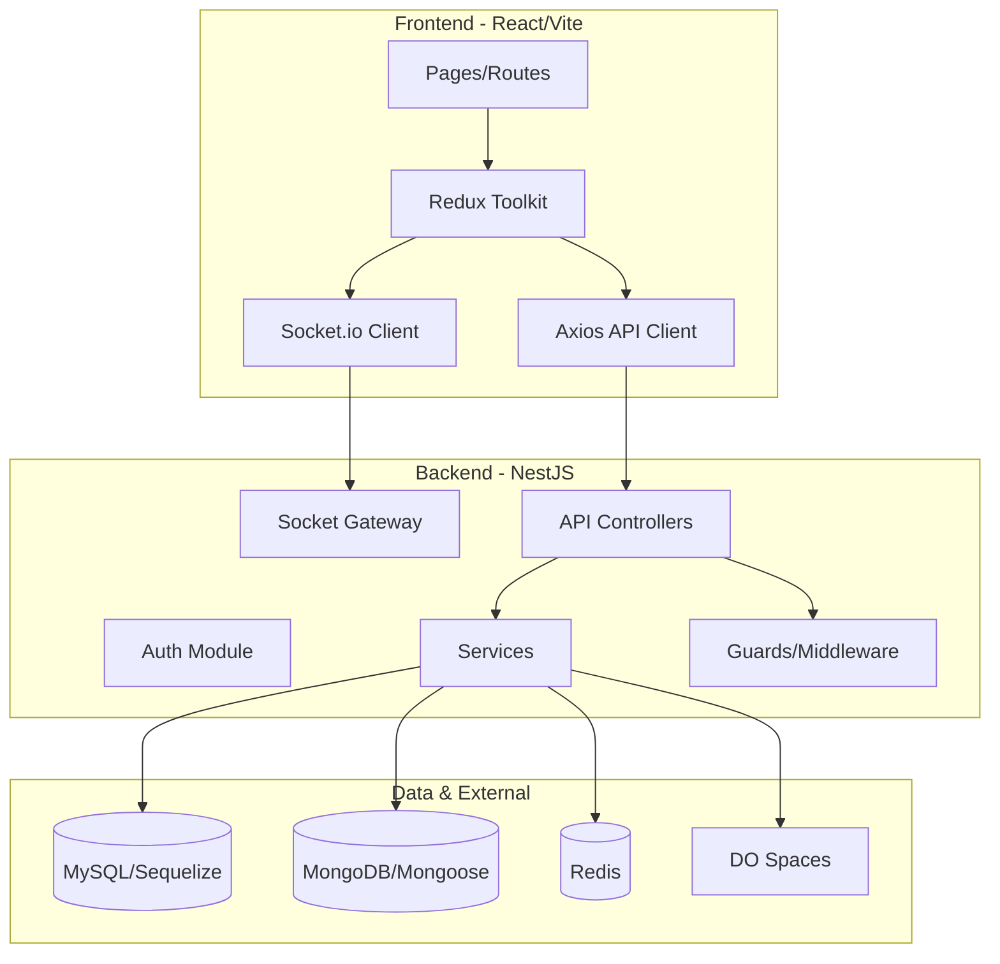

# Telemedicine App – Implementation Plan

## Architecture overview

---

## Phase 1: Project scaffolding and auth

### 1.1 Monorepo or separate repos

- **Recommended**: Single repo with two top-level folders: `backend/` and `frontend/`.
- Root: `package.json` (optional workspace), `.env.example`, `.gitignore`, and a short README.

### 1.2 Backend (NestJS) setup

- **Path**: `backend/`
- **Scaffold**: `nest new backend` (choose npm/pnpm, strict TS).
- **Add**: `@nestjs/typeorm` or `@nestjs/sequelize` (Sequelize per spec), `@nestjs/mongoose`, `@nestjs/jwt`, `@nestjs/passport`, `passport-jwt`, `sequelize`, `mysql2`, `mongoose`, `ioredis`, `@nestjs/bullmq`, `bullmq`, `@nestjs/config`, `class-validator`, `class-transformer`, `multer`, `@aws-sdk/client-s3` (for Spaces).
- **Structure** (NestJS modules):
  - `src/app.module.ts` – imports all feature modules and global config/validation.
  - `src/common/` – guards (JWT, roles), decorators (`@Roles`, `@CurrentUser`), filters (exception), interceptors (logging, transform).
  - `src/config/` – typed config (database, redis, jwt, spaces, payment providers).
  - `src/auth/` – `AuthModule`: register, login, refresh-token, logout; JWT access + refresh; strategy and guards.
  - `src/users/` – `UsersModule`: user CRUD, profile (GET/PUT), linked to `customers`, `doctors`, `staff` and `roles`.
- **Database (MySQL)**:
  - Sequelize in `backend/src/database/` (or per-module): config, migrations folder.
  - First migrations: `roles`, `permissions`, `role_permission`, `users` (with `roleId`), then `customers`, `doctors`, `staff` extending user data.
- **RBAC**: Table `roles` (e.g. superadmin, admin, doctor, staff, customer), `permissions`, `role_permission`. Guard that checks `@Roles()` and optionally fine-grained permissions.

**Key files**: `backend/src/auth/auth.controller.ts` (POST register, login, refresh, logout), `backend/src/auth/auth.service.ts`, `backend/src/auth/strategies/jwt.strategy.ts`, `backend/src/common/guards/roles.guard.ts`, `backend/src/users/users.controller.ts` (GET/PUT profile; admin: GET/POST/PUT/DELETE users).

### 1.3 Frontend (React) setup

- **Path**: `frontend/`
- **Scaffold**: `npm create vite@latest frontend -- --template react-ts`, then add Tailwind, React Router, Redux Toolkit (`@reduxjs/toolkit`, `react-redux`), Axios, Socket.io-client.
- **Structure**:
  - `src/main.tsx`, `App.tsx`, `index.css` (Tailwind).
  - `src/store/` – Redux slices: `authSlice`, later `doctorsSlice`, `appointmentsSlice`, etc.
  - `src/api/` – Axios instance (base URL, interceptors for access token, refresh on 401).
  - `src/routes/` – React Router (public, customer, doctor, staff, admin, superadmin layout routes).
  - `src/pages/` – one folder per area (auth, customer, doctor, admin, superadmin).
  - `src/components/` – shared (Button, Input, Modal, Layout, Sidebar).
- **Auth flow**: Login/Register/Forgot-password pages; role selection on register; store access/refresh in memory or httpOnly cookie; redirect by role to correct dashboard.

**Key files**: `frontend/src/api/axios.ts`, `frontend/src/store/authSlice.ts`, `frontend/src/pages/auth/Login.tsx`, `frontend/src/pages/auth/Register.tsx`, `frontend/src/App.tsx` (routes + protected route wrapper).

---

## Phase 2: Core domain – hospitals, doctors, patients, schedules

### 2.1 Backend modules and MySQL schema

- **Hospitals**: `HospitalsModule` – `hospitals` table (name, address, etc.), CRUD; admin-only create/update/delete.
- **Departments**: `DepartmentsModule` – `departments` (name, hospitalId), `doctor_department` (many-to-many). Endpoints: GET/POST departments, PUT /departments/:id (admin).
- **Doctors**: `DoctorsModule` – `doctors` (userId, bio, qualifications, specializations, etc.), `doctor_qualifications`, `specializations` tables. Endpoints: GET /doctors (public, filter by specialty, hospital, rating), GET /doctors/:id, GET /doctors/:id/schedule, POST /doctors/:id/schedule (doctor), GET /doctors/:id/patients, GET /doctors/:id/appointments.
- **Schedules**: `SchedulesModule` – `schedules`, `availability_slots`. Doctor sets weekly template and overrides; service to compute available slots for booking.
- **Patients**: `PatientsModule` – `customers` (user-linked), `family_members`, `medical_records`, `prescriptions`, `patient_status`. Endpoints: GET /patients (doctor/staff), GET /patients/:id/records, POST /patients/:id/records (doctor), GET /patients/:id/status.

**Migrations**: Add `hospitals`, `departments`, `doctor_department`, `doctors`, `schedules`, `availability_slots`, `family_members`, `medical_records`, `prescriptions`, `patient_status` (and link to existing `users`/`customers`).

### 2.2 Frontend – customer and doctor core

- **Public**: Landing page, Find Doctors (search/filter by specialty, hospital, rating), Doctor Profile (details, schedule, “Book” CTA).
- **Customer**: Dashboard (upcoming appointments, health tips placeholder), My Appointments (list, cancel, “Join call” when applicable), Medical Records (own + family), Profile Settings.
- **Doctor**: Dashboard (today’s appointments, patient list), Manage Schedule (set availability), Patients list (assigned, link to records), Appointments (confirm, start/end call, notes/prescriptions placeholder).

**API integration**: Axios calls in `frontend/src/api/` (e.g. `doctorsApi.ts`, `appointmentsApi.ts`) and Redux slices that call these and store state.

---

## Phase 3: Appointments, medical records, file storage

### 3.1 Appointments backend

- **AppointmentsModule**: Tables `appointments` (patientId, doctorId, scheduleSlotId, status, startTime, endTime, etc.). Endpoints:
  - GET /appointments (filter by user/role, date)
  - POST /appointments (book)
  - PUT /appointments/:id/cancel
  - PUT /appointments/:id/confirm (doctor)
  - GET /appointments/:id
  - POST /appointments/:id/start-call, POST /appointments/:id/end-call (update status, optional call_logs to MongoDB).
- **Validation**: Prevent double-booking, enforce business rules (cancel window, confirm by doctor).

### 3.2 Medical records and files

- **Storage**: DigitalOcean Spaces (S3-compatible). NestJS service wrapping `@aws-sdk/client-s3` for upload (medical records, prescriptions, avatars). Store keys/URLs in MySQL.
- **Medical records**: Upload endpoint (doctor/staff), associate with patient; GET list and download URL. Prescriptions as structured data (e.g. in `prescriptions` table) plus optional PDF in Spaces.
- **MongoDB (optional but included)**: `call_logs` collection for video call metadata (appointmentId, startedAt, endedAt, duration). Mongoose schema in `backend/src/database/mongo/schemas/` or in a `CallLogsModule`.

### 3.3 Frontend – appointments and records

- **Customer**: Book flow (choose slot from doctor schedule), view/cancel appointments, “Join video call” button (will hook to video in Phase 5).
- **Doctor**: Confirm appointment, start/end call buttons, form to add notes and prescriptions; upload/view medical records for a patient.
- **Medical records**: List and view (link to pre-signed URL or proxy) for own records and family members (customer) or assigned patients (doctor).

---

## Phase 4: Payments, packages, notifications

### 4.1 Payments backend

- **PackagesModule**: `packages`, `user_packages`, `payment_methods`, `transactions`, `tips`. Endpoints: GET /packages, POST /packages/buy, GET /transactions, POST /appointments/:id/tip, GET/POST /payment-methods.
- **Provider abstraction**: Service interface (e.g. `PaymentProvider`) with implementations for Stripe, PayPal, VNPay; config-driven (env vars) to choose provider. Webhooks for confirmations (Stripe webhook, etc.).
- **Billing logic**: Per-minute or per-session; deduct from user package or charge payment method; record in `transactions`.

### 4.2 Notifications and queues

- **Redis + BullMQ**: Queues for sending email/SMS (e.g. `notification queue`). Jobs: send email (nodemailer), send SMS (Twilio or similar).
- **NotificationsModule**: Table `notifications` (userId, type, title, body, readAt). In-app: GET /notifications, PUT /notifications/:id/read. On events (appointment booked, confirmed, reminder, etc.), create notification and push to queue for email/SMS.
- **MongoDB**: `notification_logs` collection for detailed push/delivery logs (optional but in scope).

### 4.3 Frontend – payments and notifications

- **Customer**: Payment methods (add card/PayPal), Buy Packages (select package, choose payment method, redirect to provider then success/cancel), transaction history.
- **Doctor**: Earnings view (consultation fees, tips from transactions).
- **Shared**: Notifications bell + list, mark as read; optional toast when new notification (Socket.io in Phase 5).

---

## Phase 5: Real-time (Socket.io) and video calls

### 5.1 Socket.io backend

- **NestJS**: `@nestjs/websockets`, `socket.io`. Gateway(s): e.g. `ChatGateway`, `NotificationGateway`. Rooms: per appointment (for chat/video signaling), per user (for notifications).
- **Use cases**: In-app notifications (emit to user room); chat messages (store in `chat_messages` table, emit to appointment room); optional signaling for WebRTC (offer/answer/ICE).
- **Auth**: Validate JWT on socket connection; attach user id to socket.

### 5.2 Video calls

- **Option A – Agora**: Integrate Agora Web SDK; backend generates token (use Agora REST or SDK); frontend joins channel by appointmentId.
- **Option B – Twilio**: Twilio Video JS SDK; backend creates room and access token; frontend joins.
- **Option C – WebRTC**: Custom signaling via Socket.io (offer/answer/ICE); record call metadata in MongoDB `call_logs`.
- **Recommendation**: Implement one provider (e.g. Twilio or Agora) behind an interface so you can swap; endpoints POST /appointments/:id/start-call (return token/room name), POST /appointments/:id/end-call (persist duration to MySQL/MongoDB).

### 5.3 Frontend – real-time and video

- **Socket.io client**: Connect with auth; listen for notifications; chat UI per appointment (if required).
- **Video**: Page or modal “Video call” – get token/room from API, initialize SDK, join channel; “End call” button calls end-call API and leaves channel.

---

## Phase 6: Reviews, feedback, logs, admin/superadmin

### 6.1 Reviews and feedback

- **ReviewsModule**: Tables `reviews`, `feedback`. POST /appointments/:id/review (customer), GET /doctors/:id/reviews. Aggregate rating on doctor profile.

### 6.2 Logs and audit

- **Activity logs**: Middleware or interceptor to log authenticated actions to `activity_logs` (userId, action, resource, timestamp). GET /logs (admin/superadmin only).
- **MongoDB**: `error_logs` collection for application errors (global exception filter that writes to MongoDB).

### 6.3 Admin and superadmin UI

- **Admin**: Manage hospitals/departments (CRUD), manage users (doctors, staff, patients), view reports (appointments, payments), manage packages.
- **Superadmin**: Same as admin plus system logs viewer, role/permission management (GET /roles, PUT /roles/:id/permissions).

**Frontend**: Admin layout and pages (tables + forms) for hospitals, departments, users, packages, reports); superadmin section for logs and roles/permissions.

---

## Phase 7: Deployment (DigitalOcean)

### 7.1 Backend

- **Option A – Droplet**: Ubuntu, Node 18+, PM2, Nginx reverse proxy, Let’s Encrypt SSL. Env: `DATABASE_URL`, `REDIS_URL`, `JWT_SECRET`, Spaces keys, payment keys. CI: GitHub Actions to build and deploy (rsync + PM2 reload or Docker).
- **Option B – App Platform**: Connect GitHub repo; build command `npm ci && npm run build`; run command `node dist/main`; add env vars in UI; use managed MySQL, Redis, and MongoDB add-ons or connection strings to DO managed DBs.

### 7.2 Frontend

- **Option A – App Platform (static)**: Build command `npm ci && npm run build`; output dir `dist`; env `VITE_API_URL` for API base URL.
- **Option B – Droplet + Nginx**: Build locally or in CI; serve `dist/` via Nginx.
- **Option C – Spaces + CDN**: Upload `dist` to bucket, enable static website; optional CDN in front.

### 7.3 Optional Docker

- `backend/Dockerfile` (multi-stage: build then node), `frontend/Dockerfile` (nginx serving static), `docker-compose.yml` for local dev (MySQL, Redis, MongoDB, backend, frontend). Not required for App Platform.

---

## Folder structure summary

**Backend (NestJS)**  
`backend/src/`  

- `app.module.ts`  
- `main.ts`  
- `common/` (guards, decorators, filters, interceptors)  
- `config/`  
- `database/` (Sequelize config + migrations; Mongoose schemas if separate)  
- `auth/`, `users/`, `hospitals/`, `departments/`, `doctors/`, `schedules/`, `patients/`, `appointments/`, `medical-records/`, `payments/`, `packages/`, `notifications/`, `reviews/`, `logs/`, `roles/` (or under users)

**Frontend (React)**  
`frontend/src/`  

- `api/`, `store/`, `routes/`, `pages/`, `components/`, `hooks/`, `types/`

---

## Database tables (MySQL) – checklist

| Area       | Tables                                                         |
| ---------- | -------------------------------------------------------------- |
| Auth/RBAC  | roles, permissions, role_permission, users                     |
| Users      | customers, doctors, staff                                      |
| Org        | hospitals, departments, doctor_department                      |
| Scheduling | schedules, availability_slots, appointments                    |
| Medical    | medical_records, prescriptions, family_members, patient_status |
| Payments   | payment_methods, transactions, packages, user_packages, tips   |
| Social     | reviews, feedback, notifications, chat_messages                |
| Meta       | doctor_qualifications, specializations, activity_logs          |

**MongoDB collections**: notification_logs, error_logs, call_logs.

---

## Implementation order (recommended)

1. **Phase 1** – Backend and frontend scaffolding, MySQL migrations for auth/users, JWT auth and RBAC, login/register and profile.
2. **Phase 2** – Hospitals, departments, doctors, schedules, patients (backend + frontend pages).
3. **Phase 3** – Appointments (book, cancel, confirm), medical records + DO Spaces, start/end call stubs.
4. **Phase 4** – Packages, payment methods, transactions, one payment provider (e.g. Stripe), notifications table + queue, MongoDB notification_logs.
5. **Phase 5** – Socket.io (notifications, chat if needed), video provider (Agora or Twilio), call_logs in MongoDB.
6. **Phase 6** – Reviews, activity_logs, error_logs (MongoDB), admin and superadmin UIs.
7. **Phase 7** – Deployment (App Platform or Droplet), CI/CD, env and SSL.

This plan keeps dependencies in order (auth first, then domain, then payments and real-time, then admin and deployment) and allows you to deliver an MVP after Phase 3–4, then add payments, video, and full admin.